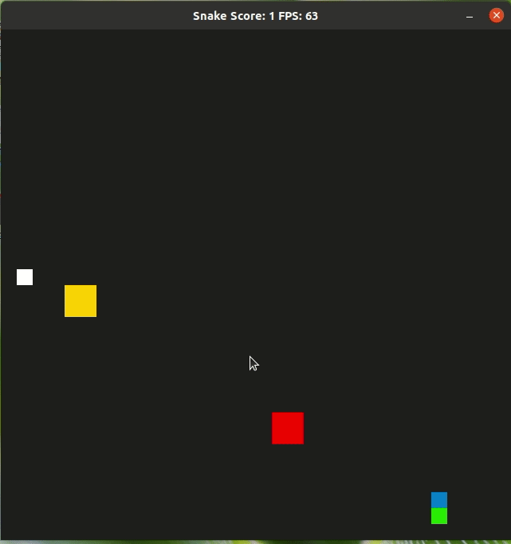

# CPPND: Capstone based on Snake Game example - Snake vs Chickens
This repo contains the Capstone project in the [Udacity C++ Nanodegree Program](https://www.udacity.com/course/c-plus-plus-nanodegree--nd213). The code for this repo was inspired by [this](https://codereview.stackexchange.com/questions/212296/snake-game-in-c-with-sdl) excellent StackOverflow post and set of responses.

## Description of the game
In this game, a Chicken (Yellow square) and a Rooster (Red square) are created in addition the Snake. 

Your goal as the Snake is to eat as many Eggs as posible.

The role of the Chicken is to go and save the Egg however if the Snake is around it will try to catch it.

The role of the Rooster is to chase the Snake no matter what.

One Egg appear anywhere after the Snake eats the previous one. 

The Snake is faster than both, the Chicken and the Snake, however they are perseverant and will protect the Eggs.

Have Fun!!!

## Dependencies for Running Locally
* cmake >= 3.7
  * All OSes: [click here for installation instructions](https://cmake.org/install/)
* make >= 4.1 (Linux, Mac), 3.81 (Windows)
  * Linux: make is installed by default on most Linux distros
  * Mac: [install Xcode command line tools to get make](https://developer.apple.com/xcode/features/)
  * Windows: [Click here for installation instructions](http://gnuwin32.sourceforge.net/packages/make.htm)
* SDL2 >= 2.0
  * All installation instructions can be found [here](https://wiki.libsdl.org/Installation)
  >Note that for Linux, an `apt` or `apt-get` installation is preferred to building from source. 
* gcc/g++ >= 5.4
  * Linux: gcc / g++ is installed by default on most Linux distros
  * Mac: same deal as make - [install Xcode command line tools](https://developer.apple.com/xcode/features/)
  * Windows: recommend using [MinGW](http://www.mingw.org/)

## Basic Build Instructions

1. Clone this repo.
2. Make a build directory in the top level directory: `mkdir build && cd build`
3. Compile: `cmake .. && make`
4. Run it: `./SnakeGame`.

## CC Attribution-ShareAlike 4.0 International

Shield: [![CC BY-SA 4.0][cc-by-sa-shield]][cc-by-sa]

This work is licensed under a
[Creative Commons Attribution-ShareAlike 4.0 International License][cc-by-sa].

[![CC BY-SA 4.0][cc-by-sa-image]][cc-by-sa]

[cc-by-sa]: http://creativecommons.org/licenses/by-sa/4.0/
[cc-by-sa-image]: https://licensebuttons.net/l/by-sa/4.0/88x31.png
[cc-by-sa-shield]: https://img.shields.io/badge/License-CC%20BY--SA%204.0-lightgrey.svg

## Rubric points addressed on the project
* ReadMe
  * Readme with instructions is included above
  * This project is based on the Snake game example and is added several features.
  * Classes given: Game, Renderer, Controller, Snake. Class added: FieldObject.
  * Rubric points is added here 
* Compiling and running correctly
* Loops, Functions, I/O
  * Many functions and structures are created
  * Project writes the score obtained to a file named scores.txt, cf. Game::writeScoresToFile
  * Project accepts user input from keyboard to play game and move snake
* Object Oriented Programming
  * Object oriented programming techniques are used. FieldObject is added as a class.
  * Appropiate classes identifiers are used: public, private, protected.
  * member list is used
  * names specify functions
  * 

* Concurrency
  * Multithreading - Many functions in the code are run in parallel. For Example, all field objects (Chickens) are independent and run in parallel, cf. FieldObject::simulate(). In subroutine Game::Update, two subroutines run in parallel as well, i.e., Game::updateSnake and Game::updateFieldObjects.
  * Promise and future is used in Snake::SnakeCell function where a thread search in the last half of the snake body while the main thread searches in the first half and get the future with the boolean information.
  * mutex are used in FieldObject::doThings() and FieldObject::~FieldObject() to notify the creation and destruction of our Chickens or Roosters.
  * A condition variable is used to communicate between two threads specifically that run Game::updateSnake and Game::updateFieldObjects in Game::Update to signal that all field Objects are updated before we update our Snake.

